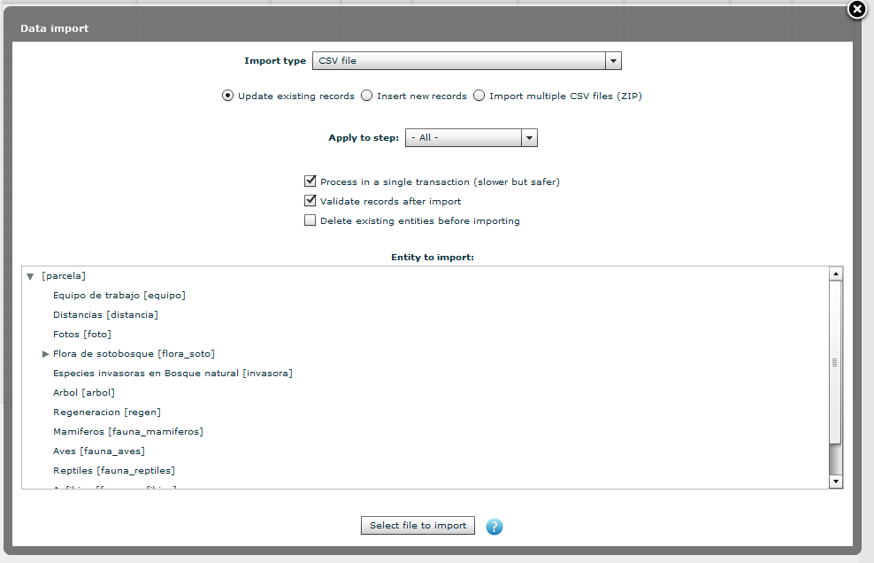

.. _sec-upload:

Workflow in OF Collect
======================

Uploading the generated csv files into the OF Collect database
--------------------------------------------------------------

The OF Collect software offers various options to import data from external sources. Besides the options to import data
in the collect xml format it is also possible to import data as plain csv text files. For each of the different
tables that is available in the OF Collect database schema a separate csv file can be uploaded. The OF upload functions
are started from the "*Data Management*" module under "*Import Data*":

    Screenshot of the OF Collect Import Dialog

As import type we select "*CSV file*". As the plot information is the 'root' knot of the OF Collect schema it is
required to upload the plot information first. When importing plot data for the first time you need to choose the option
"*Insert new records*". Once the plots are uploaded you can later uploaded modified files for the same plots with the
option "*Updated existing records*"

#. Import the plot information. If you upload the plot files to a new empty OF Collect database you need to choose the option "insert new records"
#. Import the different tree information files (e.g. arbols_bn_2010.csv, arbols_pl_2010.csv)
#. Import the fauna records
#. Import the forest flora files (sotobosque)
#. Import the soil flora file (flora suelo)

Data cleansing
--------------

While uploading the data files and internal validation will be done by OF Collect.  There are different reasons why an
error is issued when uploading the data:

* The value for a required variable was not set as it is not provided in the raw data
* The value is out of the value range
* The included validation procedures raise a warning (e.g. GPS coordinates to far from the original plot coordinates)

Before a meaningful analysis of the inventory data can be done the pending warnings and errors should be resolved for each of the plots.
OF Collect offers the data cleansing module for this task! Furthermore, the data management module shows the number of errors and warnings for each plot.
And allows to create a validation report. Further information on the data management workflow in OF collect can be found in the
`OF Collect Tutorial <http://www.openforis.org/tools/collect/tutorials/data-management.html>`_.

